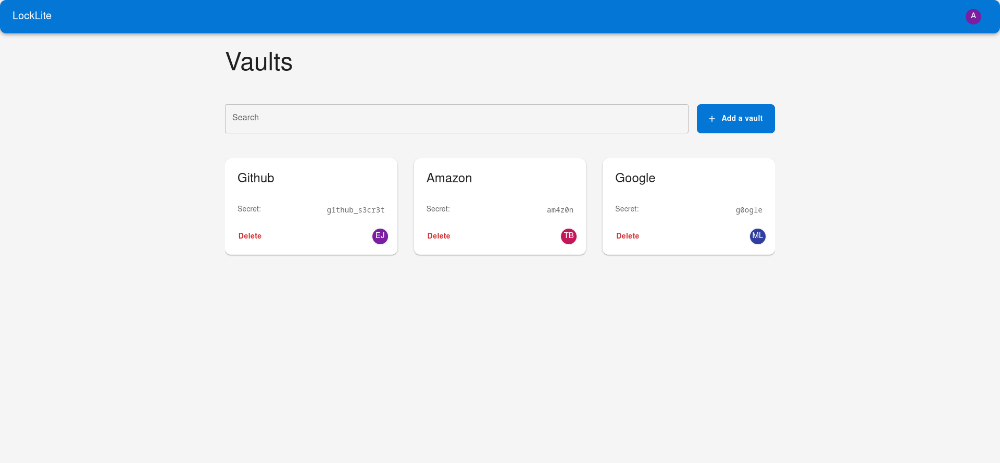

# Locklite

The Locklite project is a password manager designed to protect and organize confidential information in secure areas. In
a fictitious scenario, it is intended for companies wishing to guarantee the confidentiality of their employees' data.
In the reality of this academic project, it takes the form of an MVP developed on its own, providing a concrete
illustration of the design, deployment and supervision of a complete application.

### Stack

### Documentation

- **C2.1.1** - [Continuous Deployment](CD.md)
- **C2.1.1** - [Quality and Performance Criteria](CRITERIA.md)
- **C2.1.2** - [Continuous Integration](CI.md)
- **C2.2.3** - [Security measures](SECURITY.md)
- **C2.2.3** - [Accessibility measures](ACCESSIBILITY.md)
- **C2.2.4** - [Changelog](CHANGELOG.md)
- **C2.3.1** - [Test Plan](ACCEPTANCE.md)
- **C2.3.2** - [Defect Correction Plan](BUGS.md)
- **C2.4.1** - [Deployment Guide](DEPLOYMENT.md)
- **C2.4.1** - [User Guide](USER.md)
- **C2.4.1** - [Contributing Guide](CONTRIBUTING.md)
